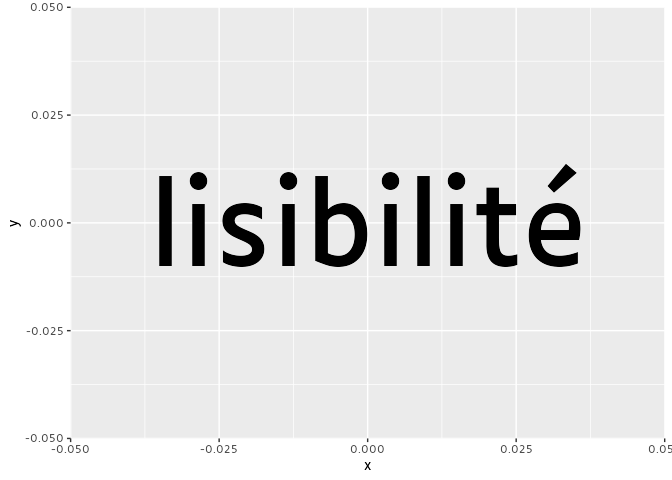

<!-- README.md is generated from README.Rmd. Please edit that file -->

# luciole

<!-- badges: start -->
<!-- badges: end -->

Luciole typeface for R projects (Shiny applications, RMarkdown
documents, ggplot2 graphics, …).

From [Luciole official
website](https://luciole-vision.com/luciole-en.html):

> Luciole (French for “firefly”) is a new typeface developed explicitly
> for visually impaired people. The result of a two-year collaboration
> between the Centre Technique Régional pour la Déficience Visuelle (the
> Regional Technical Center for Visual Impairment) and the type-design
> studio typographies.fr, this project received a grant from the Swiss
> Ceres Foundation and support from the DIPHE laboratory at the
> Université Lumière Lyon 2.

## Installation

You can install the development version of luciole from
[GitHub](https://github.com/dreamRs/luciole) with:

``` r
# install.packages("remotes")
remotes::install_github("dreamRs/luciole")
```

## Examples

### ggplot2

Register Luciole font with:

``` r
luciole::register_luciole()
```

The declare the `"Luciole"` family in your graphics:

``` r
library(ggplot2)
#> Warning in register(): Can't find generic `scale_type` in package ggplot2 to
#> register S3 method.
ggplot() +
  aes(0, 0, label = "lisibilité") +
  geom_text(size = 30, family = "Luciole") + 
  theme_grey(base_family = "Luciole")
```



In Rstudio, to use Luciole you have to select the ragg device to render
plots, see [this excellent blogpost by June
Choe](https://yjunechoe.github.io/posts/2021-06-24-setting-up-and-debugging-custom-fonts/)
for more informations.

### Shiny

For using Luciole with all text rendered in HTML in a shiny application,
use in your UI:

``` r
luciole_font()
```

Example:
